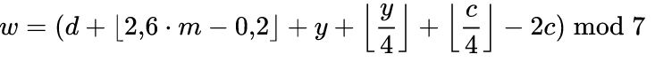

# 02:  Funktionen, Datentyp "enum"

___


(Copyright Bild: xkcd.com)

___
## 1. Übersicht
   In diesem Praktikum sind zwei Themen im Fokus: Funktionen und der Datentyp enum.
   
   Funktionen sind der wesentlichste Bestandteil der C Programmierung, welcher eine strukturierte Programmierung ermöglicht:
   * Eine Funktion ist ein Teil eines C Codes, der eine spezielle Aufgabe ausführt. Sie kann aus dem Hauptprogramm, oder aus anderen Funktionen, aufgerufen werden.
   * Jede Funktion besitzt einen eindeutigen Namen, eine eindeutige Signatur (Typen und Reihenfolge der Parameter) und einen Rückgabewert (int falls nichts angegeben wird).
   * Eine Funktion kann Werte aus dem aufrufenden Kontext übernehmen und bei Bedarf einen Wert an den aufrufenden Kontext zurückliefern.
Beispiel einer Additions-Funktion: 
```
#include <stdio.h>

/* Funktionsdeklaration */
int add(int a, int b);

int main(void) {
   int aa = 1, bb = 2, cc;
   (void) printf("%d + %d = %d", aa, bb, add(aa, bb));
   return 0;
}

/* Funktionsdefinition */
int add(int a, int b) {
   return a + b;
}
```
Der Datentyp enum wird verwendet um die Lesbarkeit von Programmen zu erhöhen: 

Beispiel eines enum: 
```
enum Ampeln = {rot =1, gelb, gruen};

int main(void) {
   Ampeln ampel1;
   if (ampel1 == rot) {...} 
   return 0;
}
```

___
## 2. Lernziele

In diesem Praktikum lernen Sie Funktionen zu definieren und aufzurufen, sowie enum anzuwenden.
  * Sie können ein Programm schreiben, welches aus mehreren Funktionen besteht.
  * Sie können Funktionen deklarieren, definieren und aufrufen.
  * Sie können enum Typen definieren und deren Werte bestimmen und abfragen.

___
## 3. Aufgaben


(Copyright Bild: www.planet-wissen.de)

### 3.1 Aufgabe 1 Tage pro Monat
In der ersten Aufgabe berechnen Sie die Anzahl Tage pro Monat einer beliebigen Kombination Monat / Jahr. 
Erweitern Sie dazu das Programm um folgende Aspekte: 
* Bereichsprüfung von Jahr und Monat  
* Funktion istSchaltjahr, welche berechnet, ob das Jahr eine Schaljahr ist
* Funktion tageProMonat, welche die Anzahl Tage des gegebenen Monats und Jahres berechnet.

Vorgaben:  
* Die Funktion istSchaltjahr nimmt einen Integer (jahr) entgegen und gibt 1 im Falle eines Schaltjahres und 0 im andreren Fall zurück
* Die Funktion tageProMonat nimmt zwei Integer (monat und jahr) entgegen und gibt die Anzahl Tage als Integer zurück
* Die Jahreszahl, welche den Funktionen übergeben wird, muss überprüft werden und grösser gleich 1599 und kleiner als 10000 sein
* Der übergebene Monat muss grösser als 0 und kleiner als 13 sein. 

Die Regeln für die Schaltjahrberechnung: 
* Schaltjahre sind alle Jahre, die durch 4 teilbar sind. 
* Eine Ausnahme bilden die Jahrhunderte (1600, 1700…). Diese sind keine Schaltjahre. 
* zu den 100er gibt es ebenfalls Ausnahmen: Diese sind immer Schaltjahre, wenn sie durch 400 teilbar sind
... also zum Beispiel 1600 ist eines, nicht jedoch 1700. Weiterführende Details finden Sie unter https://de.wikipedia.org/wiki/Gregorianischer_Kalender 

Gegeben ist die main Funktion des Programms. Ergänzen Sie die enum Definition und die fehlenden Funktionen:
* gibIntWert: Die Funktion soll einen Int Wert zurückgeben. Der Bereich, wie auch Fehleingaben sollen berücksichtigt werden. (atoi und fgets sind hier hilfreich)
* istSchaltjahr: Die Funktion gibt 1 im Falle eines Schaltjahrs und o im anderen Falle zurück.
* tageProMonat: Die Funktion gibt den die Tage des Monats für das definierte Jahr zurück. Verwenden Sie die Switch-Anweisung , sowie den enum Datentypen

```
int main (int argc, char *argv[]) {

    int monat, jahr;
    
    //  Monat einlesen und Bereich ueberpruefen
    monat = gibIntWert("Monat", 1, 12);
    jahr  = gibIntWert("Jahr", 1600, 9999);

    //  Ausgabe zum Test
    (void) printf("Monat: %d, Jahr: %d \n", monat, jahr);    
    
    //  Ausgabe zum Test (hier mit dem ternaeren Operator "?:")
    (void) printf("%d ist %s Schaltjahr\n", jahr, istSchaltjahr(jahr) ? "ein" : "kein");

    // Ausgabe
    (void) printf("Der Monat %02d-%d hat %d Tage.\n", monat, jahr, tageProMonat(jahr, monat));

    return 0;
}
```

Tipp: Angenommen Sie verwenden den enum month_t { JAN=1, FEB, MAR, APR, MAI, JUN, JUL, AUG, SEP, OKT, NOV, DEZ };
Dann können Sie im Programm direkt die Konstanten verwenden:
```
if (m == 2) ...		// schlecht lesbar
if (monat == 2) ...	// besserer Variablenname 
if (monat == FEB) ...	// am besten lesbar
```


Als Abnahme müssen die Tests unverändert ohne Fehler ausgeführt werden (`make test`)
___
### 3.2 Aufgabe 2 Bestimmen des Wochentags
Erweitern Sie das vorgegebene zweite Programm Gerüst an den bezeichneten Stellen so, dass das Programm von der Kommando Zeile ein Argument entgegennimmt, es auf Gültigkeit überprüft und schliesslich den Wochentag für das gegebene Datum berechnet und ausgibt.
Prüfen Sie die Umsetzung beider Teilaufgaben mittels make test.
#### 3.2.1	Teilaufgabe Argumente Parsen und auf Korrektheit prüfen
Das Argument stellt ein gültiges Datum unseres Gregorianischen Kalenders dar (d.h. ein Datum ab Donnerstag, den 15. Oktober 1582, mit der Gregorianischen Schaltjahr Regel).
Wenn kein Argument gegeben ist oder wenn das eingegebene Datum nicht gültig ist, soll das Programm einen Hilfetext auf stderr ausgeben und mit EXIT_FAILURE Exit Code terminieren. Wenn ein gültiges Datum erkannt wurde terminiert das Programm mit Exit Code EXIT_SUCCESS.
##### 3.2.1.1 Argument Format
Das Format des Kommando Zeilen Arguments soll yyyy-mm-dd sein, wobei yyyy für das vier-stellige Jahr, mm für einen 1-2-stelligen Monat (1…12) und dd für einen Tag des Monats, beginnend mit 01. Z.B. 2020-02-29.
##### 3.2.1.2 Korrektes Datum
Das Datum muss alle folgenden Bedingungen erfüllen damit es als korrekt erkannt wird:
* Obergrenze für ein «sinnvolles» Datum ist das Jahr 9999
* es muss Gregorianisch sein, d.h. ab 15. Oktober 1582 (inklusive)
* es darf nur Monate von 1 für Januar bis 12 für Dezember beinhalten
* der Tag muss grösser oder gleich 1 sein
* der Tag darf nicht grösser als 31 sein für Monate mit einer Länge von 31 Tagen
* der Tag darf nicht grösser als 30 sein für Monate mit einer Länge von 30 Tagen
* der Tag darf für den Februar nicht grösser sein als 29 für ein Schaltjahr
* der Tag darf für den Februar nicht grösser sein als 28 für ein Nicht-Schaltjahr

##### 3.2.1.3 Vorgaben an die Umsetzung
1. Definieren Sie einen enum Typen mit (typedef) Namen month_t dessen Werte die Englischen 3-Zeichen Abkürzungen der Monate sind, nämlich Jan, Feb, … Dec und stellen Sie sicher dass die Abkürzungen für die uns geläufigen Monatsnummer stehen.
2.	Definierend Sie einen struct Typen mit (typedef) Namen date_t und den int Elementen year, month, day. Lesen Sie das Argument (falls vorhanden) via sscanf und dem Formatstring "%d-%d-%d" in die drei Elemente einer Date Variable. Siehe dazu die Hinweise im Anhang.
3.	Für die Berechnung der Monatslänge implementieren Sie die Hilfsfunktion is_leap_year(date_t date) (nach obigen Vorgaben). Der Return Wert 0 bedeutet «Kein Schaltjahr», 1 bedeutet «Schaltjahr».
4.	Implementieren Sie die Funktion `int get_month_length(date_t date)`. Diese soll für den Monat des Datums die Monatslänge (was dem letzten Tag des Monats entspricht) ausgeben – geben Sie 0 für ungültige Monatswerte zurück.
5.	Schliesslich implementieren Sie die Funktion int is_gregorian_date(date_t date) welche prüft, ob ein gegebenes Datum im Bereich 15. Oktober 1582 und dem Jahr 9999 ist (0 = nein, 1 = ja).
6.	Implementieren Sie eine Funktion int is_valid_date(date_t date), welche obige Bedingungen für ein gültiges Datum umsetzt. Der Return Wert 0 bedeutet «Kein gültiges Datum», 1 bedeutet «Gültiges Datum». Benutzen Sie für die Prüfung des Datums die `month_t` Werte wo immer möglich und sinnvoll. Verwenden Sie die oben implementierten Hilfsfunktionen.
##### 3.2.1.4 Hinweise
Beachten Sie die Kommentare im Code für die geforderten Implementierungs-Details.
#### 3.2.2	Teilaufgabe Wochentag Berechnung
Schreiben Sie eine Funktion, welche zu einem Datum den Wochentag berechnet.
Die Formel wird Georg Glaeser zugeschrieben, möglicherweise angelehnt an eine Formel von Carl Friedrich Gauss.



(Quelle: https://de.wikipedia.org/wiki/Wochentagsberechnung)

Hier ist eine für C abgewandelte Variante davon.
```
weekday = ((day + (13 * m - 1) / 5 + y + y / 4 + c / 4 - 2 * c) % 7 + 7) % 7
alle Zahlen sind int Werte und alles basiert auf int-Arithmetik
m = 1 + (month + 9) % 12
a = year - 1 (für month < Mar), ansonsten year 
y = a % 100
c = a / 100
```
Erweitern sie das Programm so, dass vor dem erfolgreichen Terminieren des Programms folgende Zeile (inklusive Zeilenumbruch) ausgegeben wird: yyyy-mm-dd is a Ddd, wobei yyyy für das Jahr, mm für die Nummer des Monats (01…12) und dd für den Tag im Monat (01…). Z.B. 2020-02-29 is a Sat.
Vorgaben an die Umsetzung
1.	Definieren Sie einen enum Typen mit (typedef) Namen weekday_t dessen Werte die Englischen 3-Zeichen Abkürzungen der Tage sind, nämlich Sun, Mon, … Sat und stellen Sie sicher, dass die Abkürzungen für die Werte 0…6 stehen.
2.	Schreiben Sie eine Funktion weekday_t calculate_weekday(date_t date) nach der Beschreibung der obigen Formel. Das date Argument ist als gültig angenommen, d.h. es ist ein Programmier-Fehler, wenn das Programm diese Funktion mit einem ungültigen Datum aufruft. Machen Sie dafür als erste Codezeile in der Funktion eine Zu-sicherung (assert(is_valid_date(date));)
3.	Schreiben Sie eine Funktion void print_weekday(weekday_t day), welche für jeden gülteigen Tag eine Zeile auf stdout schreibt mit den Englischen 3-Zeichen Ab-kürzungen für den Wochentag, z.B. Sonntag: Sun, Montag: Mon, etc. Wenn ein ungültiger Wert für day erkannt wird, soll assert(!"day is out-of-range"); aufgerufen werden.
Hinweise
•	Für interessierte, siehe: https://de.wikipedia.org/wiki/Wochentagsberechnung


___
## 4. Bewertung

Die gegebenenfalls gestellten Theorieaufgaben und der funktionierende Programmcode müssen der Praktikumsbetreuung gezeigt werden. Die Lösungen müssen mündlich erklärt werden können.
| Aufgabe | Kriterium | Gewicht |
| :-- | :-- | :-- |
| alle | Sie können das funktionierende Programm inklusive funktionierende Tests demonstrieren und erklären. |  |
| gibIntWert | Eingabe, Bereichsüberprüfung korrekt | 1 |
| istSchaltjahr | Funktion korrekt | 1 |
| TageProMonat | Funktion korrekt | 1 |
| Aufgabe 2 | Fehlenden Teile ergänzt und lauffähig | 1 |
___
## 5. Anhang

### 5.1 Sprachelemente	

```int main(int argc, char *argv[]) {
  ...
}	argc: Anzahl Einträge in argv.
argv: Array von Command Line Argumenten.
argv[0]: wie das Programm gestartet wurde
argv[1]: erstes Argument
…
argv[argc-1]: letztes Argument
int a = 0;
int b = 0;
int c = 0;
int res = sscanf(argv[1]
                , "%d-%d-%d"
                , &a, &b, &c
                );
if (res != 3) {
    // Fehler Behandlung...
    // ...
}	
```

### 5.2 Beschreibung
Siehe man 3 sscanf.
Die Funktion sscanf gibt die Anzahl erfolgreich erkannte Argumente zurück. Unbedingt prüfen und angemessen darauf reagieren.
Die gelesenen Werte werden in a, b und c, gespeichert, dazu müssen Sie die Adresse der Variablen übergeben. Mehr Details dazu werden später erklärt.
fprintf(stderr, "Usage: %s…\n", argv[0]);	Siehe man 3 fprintf.
Schreibt formatierten Text auf den stderr Stream.

___
Version: 15.02.2022