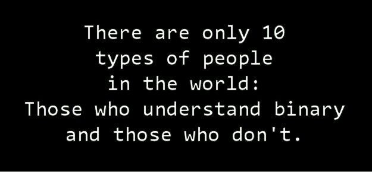

# 03 - Bit Operationen, Struct, Typedef


## 1. Bit Operationen




Bit Operationen sind allgegenwärtig in den Computer-Wissenschaften und finden in vielen Disziplinen Anwendung. Folgend ein kleiner Auszug aus den wichtigsten Themen:
- **Bit Felder**: Sind die effizienteste Art, etwas darzustellen, dessen Zustand durch mehrere "wahr" oder "falsch" definiert werden kann. Besonders auf Systemen mit begrenzten Ressourcen sollte jede überflüssige Speicher-Allozierung vermieden werden.

  Beispiel:
  ```c
  // primary colors
  #define BLUE  0b100
  #define GREEN 0b010
  #define RED   0b001

  // mixed colors
  #define BLACK   0 /* 000 */
  #define YELLOW  (RED | GREEN) /* 011 */
  #define MAGENTA (RED | BLUE) /* 101 */
  #define CYAN    (GREEN | BLUE) /* 110 */
  #define WHITE   (RED | GREEN | BLUE) /* 111 */
  ```
[https://de.wikipedia.org/wiki/Bitfeld](https://de.wikipedia.org/wiki/Bitfeld)

- **Kommunikation**: 
  - **Prüfsummen/Paritätsbit**: Übertragungsfehler und Integrität      können bis zu einem definiertem Grad erkannt werden. Je nach   Komplexität der Berechnung können mehrere Fehler erkannt oder auch korrigiert werden. 
[https://de.wikipedia.org/wiki/Parit%C3%A4tsbit](https://de.wikipedia.org/wiki/Parit%C3%A4tsbit), [https://de.wikipedia.org/wiki/Pr%C3%BCfsumme](https://de.wikipedia.org/wiki/Pr%C3%BCfsumme)
  - **Stoppbit**: Markieren bei asynchronen seriellen Datenübertragungen das Ende bzw. Start eines definierten Blocks.
[https://de.wikipedia.org/wiki/Stoppbit](https://de.wikipedia.org/wiki/Stoppbit)
  - **Datenflusssteuerung**: Unterschiedliche Verfahren, mit denen die Datenübertragung von Endgeräten an einem Datennetz, die nicht synchron arbeiten, so gesteuert wird, dass eine möglichst kontinuierliche Datenübermittlung ohne Verluste erfolgen kann.
[https://de.wikipedia.org/wiki/Datenflusssteuerung](https://de.wikipedia.org/wiki/Datenflusssteuerung)
  - ...

- **Datenkompression**: Bei der Datenkompression wird versucht, redundante Informationen zu entfernen. Dazu werden die Daten in eine Darstellung überführt, mit der sich alle – oder zumindest die meisten – Information in kürzerer Form darstellen lassen.
[https://de.wikipedia.org/wiki/Datenkompression](https://de.wikipedia.org/wiki/Datenkompression)
- **Kryptographie**: Konzeption, Definition und Konstruktion von Informationssystemen, die widerstandsfähig gegen Manipulation und unbefugtes Lesen sind. [https://de.wikipedia.org/wiki/Verschl%C3%BCsselung](https://de.wikipedia.org/wiki/Verschl%C3%BCsselung)
- **Grafik-Programmierung**: XOR (oder ^) ist hier besonders interessant, weil eine zweite Eingabe derselben Eingabe die erste rückgängig macht (ein Beispiel dazu weiter unten: "Variablen tauschen, ohne Dritt-Variable
"). Ältere GUIs verwendeten dies für die Hervorhebung von Auswahlen und andere Überlagerungen, um kostspielige Neuzeichnungen zu vermeiden. Sie sind immer noch nützlich in langsamen Grafikprotokollen (z. B. Remote-Desktop). 

### 1.1 Übungen

#### 1. Basis Operationen
Manipulationen von einzelnen Bits gehören zu den Basis Operationen und dienen als Grundlagen um weitere komplexere Konstrukte zu schaffen. 

Vervollständigen sie folgendes Beispiel mit den drei Basis-Operationen. Dabei gibt die Variable `bit` an, welches Bit manipuliert werden soll (Denken sie daran, dass die Bit-Positionen bei 0 beginnen. Bit 3 ist also das vierte Bit von rechts). Bei den gefragten Manipulationen, soll nur das angegebene `bit` geändert werden und der Rest soll unverändert bleiben:

- Bit 3 setzen: `0011 => 1011`
- Bit 1 löschen: `1011 => 1001`
- Bit 0 flippen: `1001 => 1000`

Versuchen sie die Operationen in C umzusetzen:
```c
#include <stdlib.h>
#include <stdio.h>

int main() {
  unsigned int number = 0x75;
  unsigned int bit = 3; // bit at position 3

  // Setting a bit
  number = ...;
  
  // Clearing a bit
  bit = 1;
  number = ...;
  
  // Toggling a bit
  bit = 0;
  number = ...;

  printf("number = 0x%02X\n", number);
  
  return EXIT_SUCCESS;
}
```

#### 2. Variablen tauschen (ohne Dritt-Variable)
Zwei Variablen zu vertauschen scheint ein einfach lösbares Problem zu sein. Eine offensichtliche Variante wäre mittels einer temporären Variablen:
```c
#include <stdlib.h>
#include <stdio.h>

int main(){
  int a = 3;
  int b = 4;
  printf("a: %d; b: %d\n", a, b);
  
  int temp = a;
  a = b;
  b = temp;
  
  printf("a: %d; b: %d\n", a, b);
  return EXIT_SUCCESS;
}
```

Es gibt aber auch eine Variante, die ohne zusätzliche Variable auskommt. Dabei wird die Tatsache, dass eine zweite XOR Operation eine erste XOR Operation rückgängig macht:

`0011 XOR 0100 = 0111`

`0111 XOR 0100 = 0011`

Somit kommt man von einem XOR Resultat (`0111`) wieder auf beide Anfangs Operanden zurück indem man einfach ein zweites Mal mit einem Operanden eine XOR Verknüpfung macht. Damit kann ein Operand als Zwischenspeicher dienen und man muss nicht extra eine Zusatzvariable verwenden.

Überlegen sie sich wie sie damit zwei Variablen vertauschen können ohne Zusatzvariable:
```c
#include <stdlib.h>
#include <stdio.h>

int main(){
  int a = 3;
  int b = 4;
  printf("a: %d; b: %d\n", a, b);
  
  ...
  
  printf("a: %d; b: %d\n", a, b);
  return EXIT_SUCCESS;
}
```

#### 3. Lower- / Uppercase
Folgendes Code Beispiel kann Buchstaben in Gross- oder Kleinbuchstaben wandeln mit nur einer einzigen Bit-Operation. Überlegen sie sich warum das funktioniert, damit sie es jemand anderem in ihren Worten erklären könnten. Machen sie Notizen falls nötig.
```c
#include <stdlib.h>
#include <stdio.h>

int main(){
  char word[8] = "sREedEv";
  char *wordptr = &word[0];

  while(wordptr < &word[7]) {
    printf("UPPERCASE: %c\n", *wordptr & '_'); // converts the char into uppercase regardless of the current casing
    printf("LOWERCASE: %c\n", *wordptr | ' '); // converts the char into lowercase regardless of the current casing
    wordptr++;
  }

  return EXIT_SUCCESS;
}
```

#### 4. Prüfen auf 2-er Potenz
Um eine gegebene Zahl zu prüfen ob sie eine 2er Potenz ist, können wir folgende Bit-Muster vergleichen:

Beispiel mit der Zahl 8: `1000 & 0111 == 0`. Wir prüfen also, ob die gegebene Zahl 8 (`1000`) nur ein Bit auf `1` hat und den Rest auf `0`.

Überlegen Sie sich einen Algorithmus um dies für beliebige positive Zahlen zu prüfen. Das Bitmuster, dass für die `&` Operation gebraucht wird, kann mittel Subtraktion von 1 berechnet werden (`1000 - 1 = 0111`):
```c
#include <stdio.h>
#include <stdlib.h>

int main(){
  int a = 32; // any positive number

  if(a > 0 && ...){
    printf("%d is a power of 2", a);
  }

  return EXIT_SUCCESS;
}
```
___
## 2. Struct & typedef

### 2.1 Bit Operationen Rechner
Vervollständigen sie das beiliegende Programm `bin_calculator.c`. Es soll einfache Bit-Operationen mit zwei Operanden lösen können. Die unterstützten Operationen sind: 
- & (AND)
- | (OR)
- ^ (XOR)
- < (left shift)
- \> (right shift)
  
Eine Rechnung kann direkt als einen String eingeben werden (z.B: `0x0c ^ 0x0f`). Dabei werden Hexadezimal, Oktal und Dezimal als Eingabeformate akzeptiert. Die Rechnung wird in 3 Teile aufgeteilt (Operand 1, Operand 2, Operation) und in einer Datenstruktur gespeichert (`struct`).

Als Ausgabe soll die Rechnung wie folgt dargestellt werden:
```
Bin:
00000000'00000000'00000000'00001100
00000000'00000000'00000000'00001111 ^
-----------------------------------
00000000'00000000'00000000'00000011

Hex:
0x0c ^ 0x0f = 0x03

Dec:
12 ^ 15 = 3
```

### 2.2 Einfache Formen
Der Code in `simple_shape.c` kompiliert nicht. Überlegen sie sich, wie der neue Datentype `Graphic` aussehen soll, damit alle nötigen Informationen dazu gespeichert werden können.

Eine Form (`Graphic`) wird aus folgenden Attributen zusammengesetzt:
- **Shape**: *OVAL* oder *RECTANGLE* (verwenden sie dazu einen separaten `enum` Typ)
- **Size**: Ein positiver Integer
  - Für *RECTANGLE* bestimmt er die Seitengrösse
  - Für *OVAL* bestimmt er den Radius 
- **Color**: char Pointer zu dem vordefinierten char array mit Farbinformationen. Verwenden sie: `char *color;`

Erweitern sie den Code an den markierten Stellen, damit er kompiliert. Per Terminal sollte es möglich sein die Attribute für die Form zu bestimmen, um sie danach angezeigt zu bekommen.

**Bemerkung**: Das Programm verwendet die Math Bibliothek `math.h`. Um das Programm kompilieren zu können, müssen sie das Flag `-lm` verwenden:

    gcc -o main -lm main.c

___
## 4. Bewertung

Die gegebenenfalls gestellten Theorieaufgaben und der funktionierende Programmcode müssen der Praktikumsbetreuung gezeigt werden. Die Lösungen müssen mündlich erklärt werden können.
| Aufgabe | Kriterium | Gewicht |
| :-- | :-- | :-- |
| alle | Sie können das funktionierende Programm demonstrieren und erklären. |  |
| Basis Operationen | Funktion korrekt | 0.5 |
| Variablen tauschen | Funktion korrekt | 0.5 |
| Lower- / Uppercase | Funktion korrekt | 0.5 |
| Prüfen auf 2-er Potenz | Funktion korrekt | 0.5 |
| Bit Operationen Rechner | Fehlenden Teile ergänzt und lauffähig | 1 |
| Einfache Formen | Fehlenden Teile ergänzt und lauffähig | 1 |
